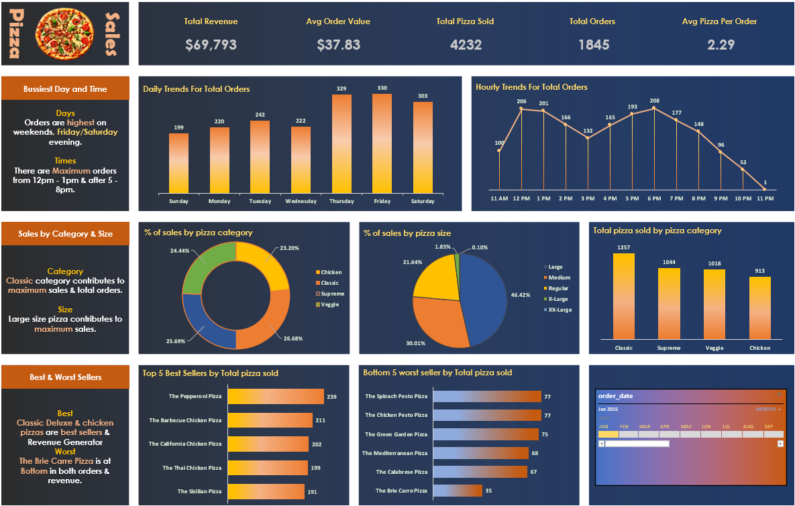

# 🍕 Pizza Sales Dashboard

**(Excel + SQL Project)**

## 1️⃣ Problem Statement
The project was done to analyze pizza sales data and extract actionable business insights. By examining sales patterns, product popularity, and customer behavior, the goal was to support data-driven decision-making. The project aims to help improve inventory planning, marketing strategy, and overall business performance.

---

## 2️⃣ Key Features / Highlights
1. **Comprehensive Sales Analysis**: Analyzed revenue, orders, and pizza quantities using interactive Excel dashboards.
2. **Customer Behavior Insights**: Identified peak sales on weekends and during lunch/dinner hours.
3. **Category & Size Performance**: Found that Classic and Large pizzas contributed the most to sales.
4. **Best & Worst Sellers**: Highlighted top-selling pizzas like Pepperoni; flagged low-performing ones like Brie Carre.
5. **SQL + Excel Integration**: Used SQL queries for data extraction and Excel for visualization and dashboard creation.

---

## 3️⃣ Objective
To analyze pizza sales data to uncover key business insights through metrics like revenue, order trends, and product performance. The project helps identify customer preferences and areas for growth, ultimately aiding in better sales strategies.

---

## 4️⃣ KPIs Tracked
- **Total Revenue**: Sum of all pizza order prices
- **Average Order Value**: Total revenue ÷ number of orders
- **Total Pizzas Sold**: Total quantity sold
- **Total Orders**: Count of unique orders
- **Average Pizzas per Order**: Pizzas sold ÷ total orders

---

## 5️⃣ Chart Requirements
Based on the business needs
- 📊 Daily Trend for Total Orders
- ⏰ Hourly Trend for Total Orders
- 🥧 % of Sales by Pizza Category
- 🥧 % of Sales by Pizza Size
- 🔻 Total Pizzas Sold by Category
- 🥇 Top 5 Best-Selling Pizzas
- 🥉 Bottom 5 Worst-Selling Pizzas
---

## 6️⃣ Process
1. **Data Cleaning**: Removed inconsistencies and missing values in Excel.
2. **SQL Analysis**: Used SQL Server to calculate KPIs and explore trends.
3. **Excel Exploration**: Created pivot tables and filters for deep dives.
4. **KPI Formatting**: Highlighted key metrics using Excel formatting tools.
5. **Data Visualization**: Designed charts and KPI tiles for insights.
6. **Dashboard Creation**: Integrated slicers for interactivity and better UX.

---

## 7️⃣ Dashboard Image

---

## 8️⃣ Tools Used
- Microsoft Excel (Pivot Tables, Charts, Slicers)
- SQL Server Management Studio
- Excel Functions & Conditional Formatting
- GitHub for version control and project presentation

---

## 9️⃣ Connect with Me
- 🔗 [LinkedIn](https://www.linkedin.com/in/swastik-purohit-0a1477251/)  
- 🐱 [GitHub](https://github.com/swastikpurohit)  
- 📧 Email: swastikp107@gmail.com 

---

